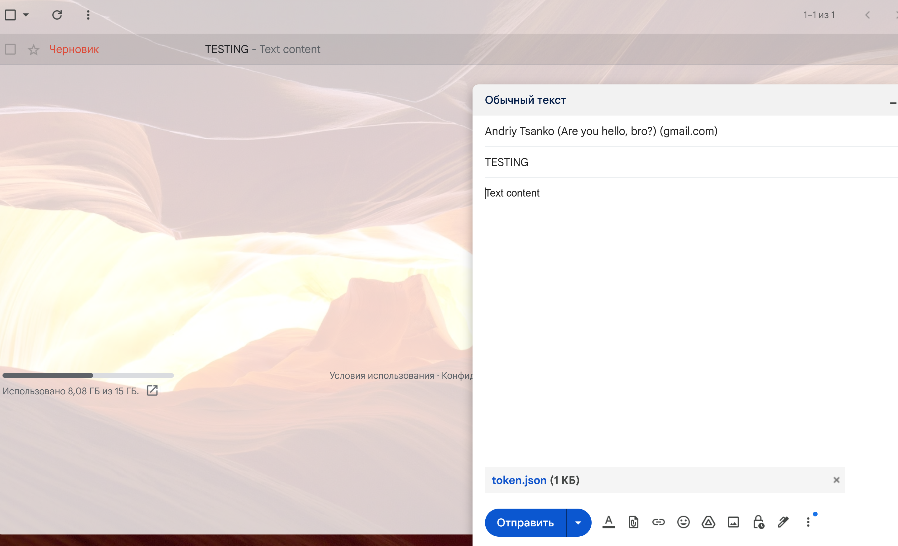

### Code decisions made

- Using **MIMEMultipart** to create an email message: MIMEMultipart is a flexible and powerful tool for creating email messages that can contain text, images, audio, and video.
- Using **base64** encoding for the body of an email message: Base64 encoding is a standard way of encoding binary data into a text format. This is necessary so that the Gmail API can accept the body of an email message as a string.
- Using the **googleapiclient** library for authorization using OAuth: The googleapiclient library provides a convenient way to authorize using OAuth to access Google's APIs.

---

### Code Design:

- EmailDraft Class: The EmailDraft class is an object that can be used to create email drafts. The class is divided into several methods, each responsible for a specific task. This makes the code clearer and easier to use.
- Draft function: The draft function is the main method of the EmailDraft class. It accepts recipients, subject, message body and attachment list as arguments. The function creates a MIMEMultipart object for an email message, adds the message body and attachments to it, and then sends an API request to create a draft.

---

### Using OOP:
- Yes, I have used OOP in this code. The EmailDraft class is an object that can be used to create email drafts. The class has several methods, each responsible for a specific task. This makes the code clearer and easier to use.

---

Of course, the use of OOP is not mandatory to create this code. However, in my opinion, using OOP improves the readability, understandability, extensibility, and modularity of the code.

